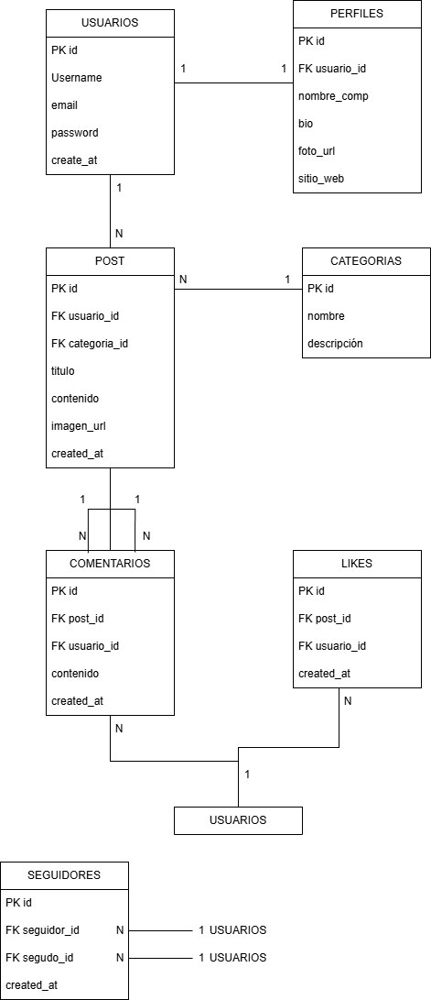

# Red Social API

## Descripción del proyecto
API REST para una red social construida con Node.js, Express y SQLite. Permite gestionar usuarios, perfiles, posts, comentarios, likes, categorías y seguidores.

## URL en producción
https://tu-url.onrender.com

## Autenticación
Todas las peticiones requieren el siguiente header:
```
password: RedSocial2024
```

## Modelo de datos
7 tablas relacionadas entre sí:
- **usuarios** — almacena las cuentas de usuario
- **perfiles** — información adicional del usuario (FK → usuarios)
- **categorias** — categorías de los posts
- **posts** — publicaciones (FK → usuarios, categorias)
- **comentarios** — comentarios en posts (FK → posts, usuarios)
- **likes** — likes en posts (FK → posts, usuarios)
- **seguidores** — relaciones de seguimiento (FK → usuarios)

## Endpoints por tabla

### Usuarios
| Método | Ruta | Descripción |
|--------|------|-------------|
| GET | /usuarios | Listar todos |
| GET | /usuarios/:id | Obtener uno |
| POST | /usuarios | Crear |
| PUT | /usuarios/:id | Actualizar |
| DELETE | /usuarios/:id | Eliminar |

### Perfiles
| Método | Ruta | Descripción |
|--------|------|-------------|
| GET | /perfiles | Listar todos |
| GET | /perfiles/:id | Obtener uno |
| POST | /perfiles | Crear |
| PUT | /perfiles/:id | Actualizar |
| DELETE | /perfiles/:id | Eliminar |

### Categorías
| Método | Ruta | Descripción |
|--------|------|-------------|
| GET | /categorias | Listar todos |
| GET | /categorias/:id | Obtener uno |
| POST | /categorias | Crear |
| PUT | /categorias/:id | Actualizar |
| DELETE | /categorias/:id | Eliminar |

### Posts
| Método | Ruta | Descripción |
|--------|------|-------------|
| GET | /posts | Listar todos |
| GET | /posts/:id | Obtener uno |
| POST | /posts | Crear |
| PUT | /posts/:id | Actualizar |
| DELETE | /posts/:id | Eliminar |

### Comentarios
| Método | Ruta | Descripción |
|--------|------|-------------|
| GET | /comentarios | Listar todos |
| GET | /comentarios/:id | Obtener uno |
| POST | /comentarios | Crear |
| PUT | /comentarios/:id | Actualizar |
| DELETE | /comentarios/:id | Eliminar |

### Likes
| Método | Ruta | Descripción |
|--------|------|-------------|
| GET | /likes | Listar todos |
| GET | /likes/:id | Obtener uno |
| POST | /likes | Crear |
| PUT | /likes/:id | Actualizar |
| DELETE | /likes/:id | Eliminar |

### Seguidores
| Método | Ruta | Descripción |
|--------|------|-------------|
| GET | /seguidores | Listar todos |
| GET | /seguidores/:id | Obtener uno |
| POST | /seguidores | Crear |
| PUT | /seguidores/:id | Actualizar |
| DELETE | /seguidores/:id | Eliminar |

## Tecnologías utilizadas
- Node.js
- Express
- better-sqlite3
- dotenv
- nodemon

## Instrucciones para correr localmente
1. Clonar el repositorio
2. Instalar dependencias:
\`\`\`bash
npm install
\`\`\`
3. Crear archivo `.env`:
\`\`\`
PORT=3000
API_PASSWORD=RedSocial2024
\`\`\`
4. Iniciar en desarrollo:
\`\`\`bash
npm run dev
\`\`\`

## Ficha
SENA CTMA · ADSO · Ficha 3229209


## Diagrama ER

Imagen del diagram:

